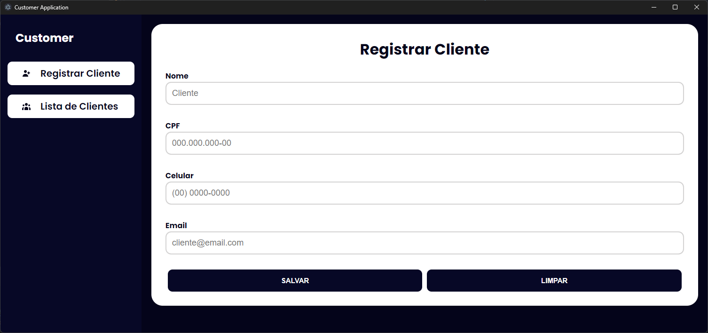

# Customer APP


---
<div style="display: flex; flex-direction: column; align-items: center; align-content: center; justify-content: center; gap: 0.25rem;">

[](https://opensource.org/licenses/MIT)
[](https://www.typescriptlang.org/)
[]()
[]()

[](https://react.dev/)
[](https://tanstack.com/query/v5/docs/framework/react/overview)
[](https://www.typescriptlang.org/)
[](https://styled-components.com/)
[](https://prettier.io/)
[](https://eslint.org/)
[](https://electron-vite.org/)

</div>

---


## Sobre
Aplicação de gestão de clientes permite realizar várias operações relacionadas aos clientes. Aqui estão algumas das funcionalidades principais: **Cadastro de Clientes**, **Listagem de CLientes** e **Busca de Clientes**.



---

## Execução

<h4>1. Clonagem</h4>
```bash
git clone https://github.com/marllonmendez/stories.git
```

<h4>2. Instalação das dependências</h4>
```bash
npm install
```

<h4>3. Build do projeto</h4>
```bash
npm run build
```

<h4>4. Execução local</h4>
```bash
npm run dev
```

---

## Licença

Este projeto está licenciado sob a [Licença MIT](LICENSE).
